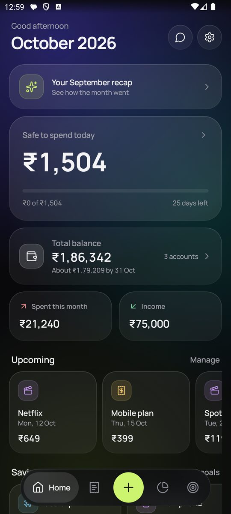
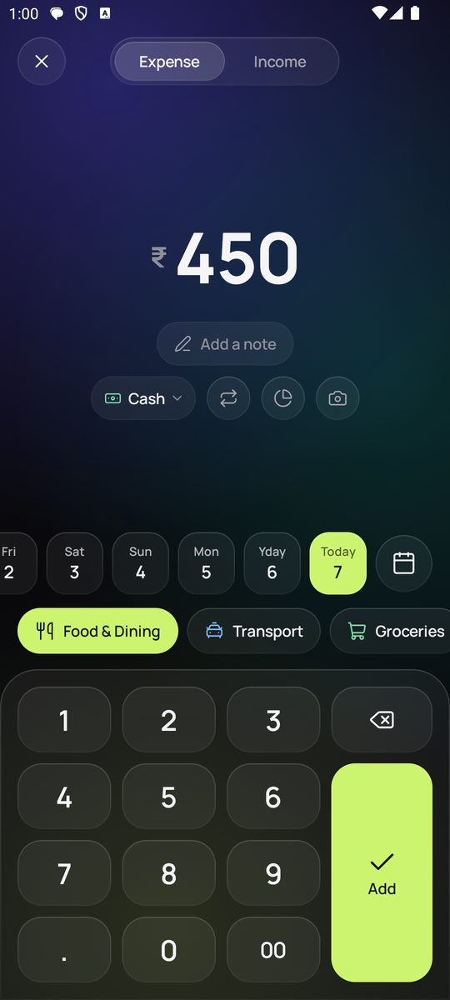
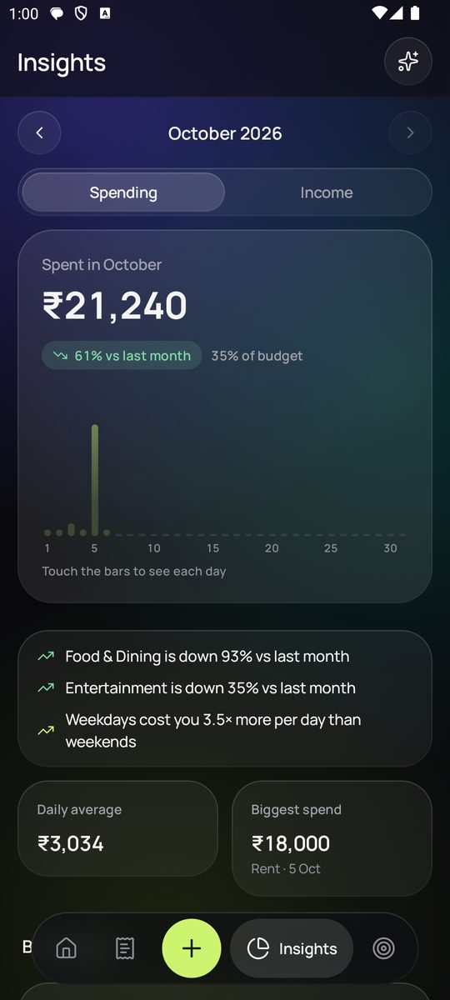
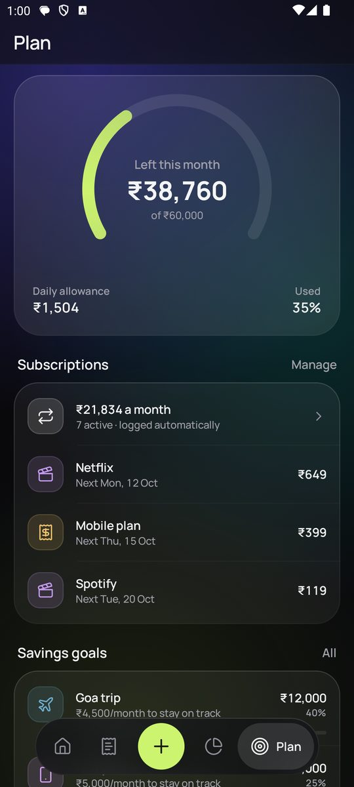
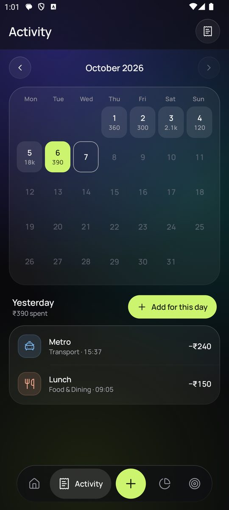
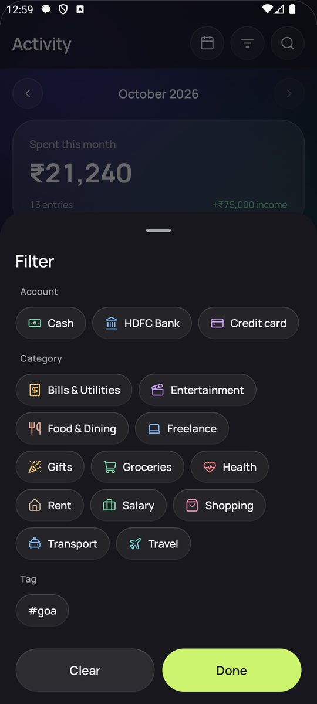
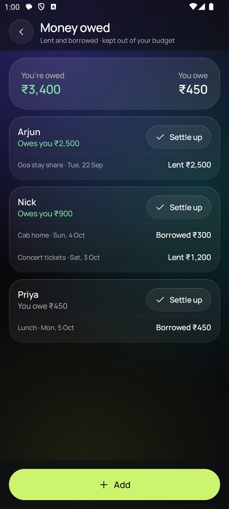
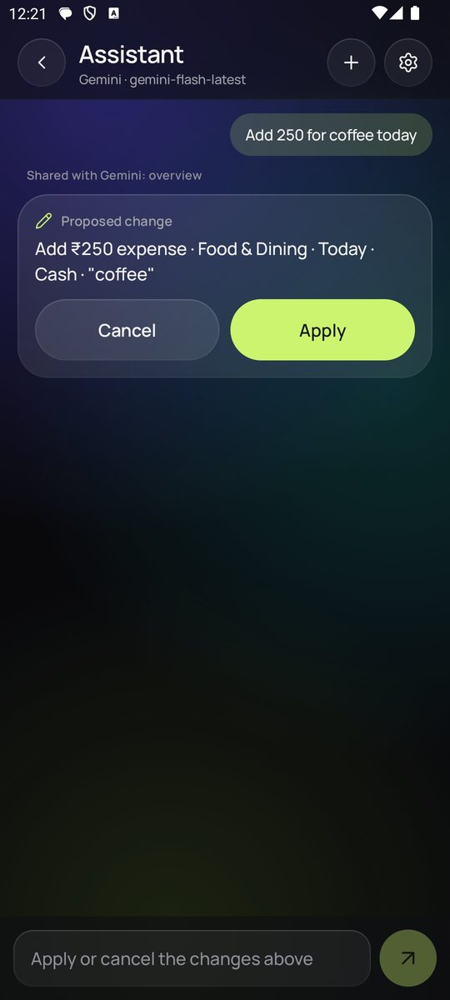

<div align="center">


# Leftovers

**Know what's left.**
A fast, private expense tracker for Android. Log a spend in two taps, see what's safe to spend
today, plan for the things you want, and ask an AI about your money if you'd like to.

[](https://github.com/saisaharsh3/Leftovers/actions/workflows/build.yml)
[](https://github.com/saisaharsh3/Leftovers/releases/latest)


[](LICENSE)

&nbsp;
&nbsp;
&nbsp;


&nbsp;
&nbsp;
&nbsp;


</div>

## Features

**Everyday tracking**
- Keypad-first entry; tap a digit to place a cursor and fix just that digit
- Expenses and income with categories, notes, accounts and receipt photos
- Add forgotten spending for any past day from a date strip or calendar
- Split one bill across several categories
- Search every entry by note, category or amount; filter by account, category or #tag
- Add #tags to notes (*"Dinner #goa"*) to group entries across categories and months, with a total
- Edit with a tap; swipe left to delete, with undo

**Budgets that make sense day to day**
- Monthly budget, or a yearly one split evenly, by smart rollover, or custom per month
- *Safe to spend today*: what's left, minus bills still due, spread over the remaining days
- Gifts, bonuses and other extra income add to that month's budget (switch per income category)
- When a month ends, choose whether what's left carries into the next month, or set it to always or never
- Per-category limits with alerts at 80% and 100%

**Planning**
- Subscriptions and recurring income every month, every 3 or 6 months, or yearly, logged automatically on their
  day, with a reminder the morning before a bill; longer cycles count as their monthly share in totals
- Skip a single payment without stopping the subscription
- Spots repeating expenses that look like a subscription and offers to add them
- Savings goals that say how much to put aside each month and whether you're on track
- Accounts (cash, bank, UPI, cards) with live balances, transfers, a breakdown of how each balance adds up,
  and a one-step move of every entry to another account (with undo)
- Total balance across accounts on Home, with where it's heading by the end of the month
- Money owed: what you lent or borrowed and from whom, settled with a tap and kept out of your budget

**Insights**
- Daily bar chart you can touch to read any day
- Category breakdown that opens each category's entries
- Spending calendar that opens any day's entries
- Trends: category changes vs last month, weekend spending, where the month is heading
- Month-over-month comparison and a story-style monthly recap you can share as an image

**AI assistant** (optional)
- Connect Claude, ChatGPT, Gemini, Mistral, Groq, DeepSeek, Grok, OpenRouter or your own server, with your own API key
- Ask questions like *"How much did I spend on food this month?"* or *"Am I on track with my budget?"*
- Tell it what to do: *"Add 250 for coffee today"*, *"Move yesterday's lunch to Cash"*, *"Set a 5,000 limit on Shopping"*
- Snap a bill or receipt and it suggests the entries, split by category
- Every change it proposes waits for you to tap **Apply**. See [AI assistant](#ai-assistant) below.

**Extras**
- Home-screen widgets: *Safe to spend today* (with one-tap add) and *Left this month*
- Evening reminder, app lock (fingerprint, face or PIN)
- Backup and restore to a file or Google Drive, weekly automatic backups to a folder you choose, CSV export
- Optional backup password: backups are encrypted (AES-256) and need it to restore
- Optional bank-SMS detection that suggests entries for you to confirm
- Swipe sideways to move between Home, Activity, Insights and Plan
- Dark glass design with spring animations and high-refresh-rate support; light theme available

## Privacy

Everything stays on your device. There are no accounts, ads or analytics, and the app makes no
network calls unless you connect the optional AI assistant.

- The app is excluded from Android's automatic cloud backup, so backups go only where you save them.
- With app lock on, screenshots are blocked and the app is hidden in the recent-apps preview.
- SMS detection is off by default. When on, messages are read on the device and nothing is added without your tap.
- With a backup password, backup files are encrypted. The password is kept encrypted with an Android Keystore key
  and is never written into a backup; if it's forgotten, those backups can't be opened.
- Network access is HTTPS-only and trusts only the system's certificate authorities.

## AI assistant

Tap the chat button on Home (or **Settings → AI assistant**), pick a provider, paste an API key and tap **Connect**.
Tap **Load models** to see every model your key can use.

| Provider | Get a key | Default model |
| --- | --- | --- |
| Claude | [console.anthropic.com](https://console.anthropic.com/settings/keys) | `claude-opus-5-5` (also `claude-sonnet-5-5`, `claude-haiku-4-5`) |
| ChatGPT | [platform.openai.com](https://platform.openai.com/api-keys) | `gpt-5-mini` |
| Gemini | [aistudio.google.com](https://aistudio.google.com/api-keys) | `gemini-flash-lite-latest` (fastest; also `gemini-flash-latest`, `gemini-pro-latest`) |
| Mistral | [console.mistral.ai](https://console.mistral.ai/api-keys) | `mistral-small-latest` |
| Groq | [console.groq.com](https://console.groq.com/keys) | `llama-3.3-70b-versatile` |
| DeepSeek | [platform.deepseek.com](https://platform.deepseek.com/api_keys) | `deepseek-chat` |
| Grok (xAI) | [console.x.ai](https://console.x.ai) | `grok-4` |
| OpenRouter | [openrouter.ai](https://openrouter.ai/keys) | `openrouter/auto` (one key for many models) |
| Custom | your server | any OpenAI-compatible HTTPS server, e.g. one you host yourself |

Usage is billed by the provider to your own account. **Answer style** switches between *Quick*
(the default: a few seconds per answer) and *Thorough* (the model thinks longer).

**What it can do**

- Answer questions: totals for any period, biggest expenses, budget progress, subscriptions, goals.
- Log, edit and delete entries, including by date (*"Move the parking from October 3 to October 5"*).
  If several entries match, it asks which one instead of guessing.
- Set the monthly budget and category limits, add or stop subscriptions, move money between accounts,
  and add to savings goals.
- **Read bills:** tap the camera in the chat to take a photo or pick a screenshot of a bill or receipt.
  It proposes one entry per category, dated from the bill, with any discount or tax spread so the
  entries add up to what you paid.

**Guardrails**

- **Nothing changes without you.** Each change appears as a card with **Confirm** and **Not now**
  (*Confirm all* when there are several). Turn off *Let it propose changes* for read-only use.
- **It sees only what a question needs.** It already knows your category and account names; amounts come
  through specific commands (totals first, at most 50 entries at a time), and each reply shows what it looked at.
- **Personal details stay hidden.** Notes stay on the phone unless you turn on *Share entry notes*. Card and
  account numbers, UPI IDs, phone numbers and emails are blanked out first. Saved receipt photos and SMS are
  never sent; a photo goes only when you attach it, resized and re-encoded so location and camera data are removed.
- **Your key is protected.** It's encrypted with an Android Keystore key, never included in backups, and
  deleted when you disconnect. Custom servers must use HTTPS.
- **Nothing is kept.** Chats aren't saved on the phone. The AI is told to treat your data as data, not
  instructions, and each message is limited in how many steps and changes it can make.

What you send is handled under the chosen provider's privacy policy (DeepSeek stores data in China;
OpenRouter passes requests on to the model's own provider).

## Install

1. Open the [latest release](https://github.com/saisaharsh3/Leftovers/releases/latest) on your phone and download `leftovers-<version>.apk`.
2. Open the file. If Android asks, allow your browser or file manager to **install unknown apps**.
3. Tap **Install**. Updates install over the top and keep your data.

Requires Android 8.0 (API 26) or newer. What's new in each version is in [CHANGELOG.md](CHANGELOG.md).

## Development

### Build and test

You need **JDK 17 or newer** and the **Android SDK**; [Android Studio](https://developer.android.com/studio) provides both.

```bash
git clone https://github.com/saisaharsh3/Leftovers.git
cd Leftovers

./gradlew assembleDebug        # app/build/outputs/apk/debug/app-debug.apk
./gradlew installDebug         # install on a connected phone (USB debugging on)
./gradlew testDebugUnitTest    # unit tests: budget maths, forecasts, backups, database upgrades, privacy, every AI provider's format
```

Debug builds install as a separate app, **Leftovers Dev** (amber icon), so they never touch the real app's data.
On Windows use `gradlew.bat`. If Gradle can't find the SDK, create `local.properties` with
`sdk.dir=/path/to/Android/Sdk` (Android Studio does this for you).

### Signed release build

1. Create a keystore once and keep it safe. Every future update must be signed with the same key.
   ```bash
   keytool -genkeypair -v -keystore release.jks -keyalg RSA -keysize 2048 -validity 10000 -alias leftovers
   ```
2. Copy `keystore.properties.example` to `keystore.properties` and fill in the passwords.
   Both files are git-ignored.
3. Run `./gradlew assembleRelease`. The APK is in `app/build/outputs/apk/release/`.

### Publishing a GitHub release

Pushing a tag such as `v1.2.0` runs the [release workflow](.github/workflows/release.yml), which runs
the tests, builds a signed APK and attaches it to a GitHub release. It needs these repository secrets
(**Settings → Secrets and variables → Actions**):

| Secret | Value |
| --- | --- |
| `SIGNING_KEYSTORE_BASE64` | `base64 -w0 release.jks` (PowerShell: `[Convert]::ToBase64String([IO.File]::ReadAllBytes("release.jks"))`) |
| `SIGNING_STORE_PASSWORD` | keystore password |
| `SIGNING_KEY_ALIAS` | `leftovers` |
| `SIGNING_KEY_PASSWORD` | key password |

Bump `versionCode` and `versionName` in `app/build.gradle.kts`, then:

```bash
git tag v1.2.0
git push origin v1.2.0
```

### Tech stack

- Kotlin, Jetpack Compose, Material 3
- Room (SQLite) with versioned migrations, DataStore for settings
- WorkManager (reminders, bill alerts, automatic backups), Glance (widgets), Biometric (app lock)
- AI providers called over plain HTTPS with `org.json`, so no extra SDKs ship in the app
- [Haze](https://github.com/chrisbanes/haze) for frosted-glass blur
- [Lucide](https://lucide.dev) icons and the [Manrope](https://github.com/davelab6/manrope) typeface

```
app/src/main/java/com/leftovers/app/
├── ai/          AI assistant: provider clients, commands, privacy filter, encrypted key storage
├── data/        Room entities, DAOs, repositories, budget and trend maths
├── ui/          Compose screens, components, theme, icons
├── util/        Formatting, alerts, reminders, backups, SMS parsing
└── widget/      Home-screen widgets
```

## Notes

- **Bank SMS detection** uses the `RECEIVE_SMS` permission, which Google Play restricts to default SMS
  apps and a few exceptions. It works for direct APK installs; remove it before publishing to Play.
- The `INTERNET` permission is used only by the AI assistant, after you connect a provider.
- Receipt photos aren't included in backups.

## Contributing

Contributions are welcome. Read [CONTRIBUTING.md](CONTRIBUTING.md), pick an
[issue](https://github.com/saisaharsh3/Leftovers/issues), and open your pull request against the **`dev`** branch.
Changes are tested from `dev` before they reach `main` and a release.

## License

[MIT](LICENSE). Third-party assets are listed in [THIRD_PARTY_NOTICES.md](THIRD_PARTY_NOTICES.md).

Made by C. Sai Saharsh · [github.com/saisaharsh3](https://github.com/saisaharsh3)
