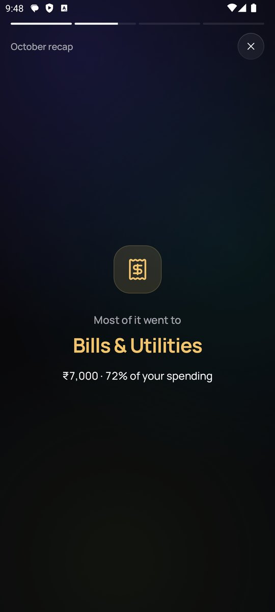

<div align="center">

# Leftovers

**Know what's left.**
A fast, private expense tracker for Android. Log a spend in two taps, see what's safe to spend
today, and plan for the things you want.

[](https://github.com/saisaharsh3/Leftovers/actions/workflows/build.yml)


[](LICENSE)

&nbsp;
&nbsp;


&nbsp;
&nbsp;


</div>

## Features

**Everyday tracking**
- Keypad-first entry
- Expenses and income, with categories, notes, accounts and receipt photos
- Add forgotten spending for any past day from a date strip or the calendar view
- Edit with a tap, swipe left to delete with undo

**Budgets that make sense day to day**
- Monthly budget, or a yearly budget split evenly, with smart rollover, or custom per month
- *Safe to spend today*: what's left, minus bills still due, spread over the remaining days
- Income like gifts or bonuses adds to that month's budget; choose per income category
- When a month ends, choose whether what's left carries into the next month (or set it to always or never)
- Per-category limits and alerts at 80% and 100%

**Planning**
- Subscriptions and recurring income, logged automatically on their billing day; turn on *Monthly* while adding to make any entry repeat
- Savings goals that tell you how much to put aside each month, and whether you're on track
- Accounts (cash, bank, UPI, cards) with live balances and transfers, and your total balance on Home

**Insights**
- Daily bar chart, category breakdown, spending calendar and month-over-month comparison
- A story-style monthly recap

**Extras**
- Home-screen widget with a one-tap add button
- Evening reminder, app lock (fingerprint, face or PIN), backup and restore to a file or Google Drive, CSV export
- Optional bank-SMS detection that suggests entries for you to confirm
- Dark glass design with smooth, spring-based animations; light theme available

## Privacy

Everything stays on your device. There are no accounts, ads, analytics or network calls.
The app is excluded from Android's automatic cloud backup, so backups go only where you choose to
save them. With app lock on, screenshots are blocked and the app is hidden in the recent-apps
preview. SMS detection is off by default; when it is on,
messages are read on the device and nothing is added without your tap.

## Install

### Download the APK

1. Open the [latest release](https://github.com/saisaharsh3/Leftovers/releases/latest) on your phone and download `leftovers-<version>.apk`.
2. Open the file. If Android asks, allow your browser or file manager to **install unknown apps**.
3. Tap **Install**. Updates install over the top and keep your data.

Requires Android 8.0 (API 26) or newer.

### Build from source

You need **JDK 17 or newer** and the **Android SDK**. The easiest way to get both is [Android Studio](https://developer.android.com/studio).

```bash
git clone https://github.com/saisaharsh3/Leftovers.git
cd Leftovers

# Debug build: app/build/outputs/apk/debug/app-debug.apk
./gradlew assembleDebug

# Or install straight onto a connected phone (USB debugging on)
./gradlew installDebug
```

On Windows use `gradlew.bat` instead of `./gradlew`. If Gradle can't find the SDK, create
`local.properties` with `sdk.dir=/path/to/Android/Sdk`. Android Studio does this for you.

### Signed release build

1. Create a keystore once and keep it safe. You need the same key for every future update.
   ```bash
   keytool -genkeypair -v -keystore release.jks -keyalg RSA -keysize 2048 -validity 10000 -alias leftovers
   ```
2. Copy `keystore.properties.example` to `keystore.properties` and fill in the passwords.
   Both files are git-ignored.
3. Run `./gradlew assembleRelease`. The APK is in `app/build/outputs/apk/release/`.

### Publishing a GitHub release

Pushing a tag such as `v1.0.0` runs the [release workflow](.github/workflows/release.yml),
which builds a signed APK and attaches it to a GitHub release. Add these repository secrets first
(**Settings → Secrets and variables → Actions**):

| Secret | Value |
| --- | --- |
| `SIGNING_KEYSTORE_BASE64` | `base64 -w0 release.jks` (PowerShell: `[Convert]::ToBase64String([IO.File]::ReadAllBytes("release.jks"))`) |
| `SIGNING_STORE_PASSWORD` | keystore password |
| `SIGNING_KEY_ALIAS` | `leftovers` |
| `SIGNING_KEY_PASSWORD` | key password |

```bash
git tag v1.0.0
git push origin v1.0.0
```

## Tech stack

- Kotlin, Jetpack Compose, Material 3
- Room (SQLite) with versioned migrations, DataStore for settings
- WorkManager (reminders), Glance (widget), Biometric (app lock)
- [Haze](https://github.com/chrisbanes/haze) for frosted-glass blur
- [Lucide](https://lucide.dev) icons and the [Manrope](https://github.com/davelab6/manrope) typeface

```
app/src/main/java/com/leftovers/app/
├── data/        Room entities, DAOs, repositories, budget maths
├── ui/          Compose screens, components, theme, icons
├── util/        Formatting, alerts, reminders, backup, SMS parsing
└── widget/      Home-screen widget
```

## Notes

- **Bank SMS detection** uses the `RECEIVE_SMS` permission, which Google Play restricts to
  default SMS apps and a few exceptions. It works for direct APK installs; remove it before
  publishing to Play.
- Receipt photos aren't included in backups.

## License

[MIT](LICENSE). Third-party assets are listed in [THIRD_PARTY_NOTICES.md](THIRD_PARTY_NOTICES.md).
